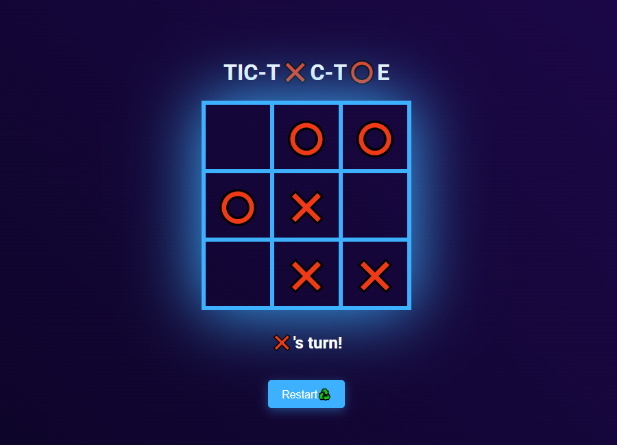

# TIC-T❌C-T⭕E



## Table of contents

- [TIC-T❌C-T⭕E](#tic-tc-te)
  - [Table of contents](#table-of-contents)
  - [Technologies](#technologies)
  - [Setup](#setup)
  - [Code Examples](#code-examples)
  - [Status](#status)
  - [Inspiration](#inspiration)
  - [Contact](#contact)
  - [Instructions for use](#instructions-for-use)
  - [Code Quality Checks](#code-quality-checks)
  - [Continuous Integration (CI)](#continuous-integration-ci)
  - [Repo Setup](#repo-setup)

## Technologies

- HTML
- CSS
- JavaScript

## Setup

- `npm run start`
- `npm install`

## Code Examples

```js
export function checkWin(squares, currentPlayer) {
  return winning_combinations.some(
    ([a, b, c]) =>
      squares[a].textContent === currentPlayer &&
      squares[b].textContent === currentPlayer &&
      squares[c].textContent === currentPlayer
  );
}
```

## Status

Project is: _done_

## Inspiration

Project by Roman Kovbinka

## Contact

[Roman](https://github.com/kovbinka)

## Instructions for use

<details>
  <summary>Getting Started</summary>

<!-- a guide to using this repository -->

1. `git clone github.com/kovbinka/tic-tac-toe.git`
2. `npm install`

## Code Quality Checks

- `npm run format`: Makes sure all the code in this repository is well-formatted
  (looks good).
- `npm run lint:ls`: Checks to make sure all folder and file names match the
  repository conventions.
- `npm run lint:md`: Will lint all of the Markdown files in this repository.
- `npm run lint:css`: Will lint all of the CSS files in this repository.
- `npm run validate:html`: Validates all HTML files in your project.
- `npm run spell-check`: Goes through all the files in this repository looking
  for words it doesn't recognize. Just because it says something is a mistake
  doesn't mean it is! It doesn't know every word in the world. You can add new
  correct words to the [./.cspell.json](./.cspell.json) file so they won't cause
  an error.
- `npm run accessibility -- ./path/to/file.html`: Runs an accessibility analysis
  on all HTML files in the given path and writes the report to
  `/accessibility_report`

## Continuous Integration (CI)

When you open a PR to `main`/`master` in your repository, GitHub will
automatically do a linting check on the code in this repository, you can see
this in the[./.github/workflows/lint.yml](./.github/workflows/lint.yml) file.

If the linting fails, you will not be able to merge the PR. You can double check
that your code will pass before pushing by running the code quality scripts
locally.

## Repo Setup

- Give each member **_write_** access to the repo (if it's a group project)
- Turn on GitHub Pages and put a link to your website in the repo's description
- Go to _General_ Section > check **Discussions**
- In the _Branches_ section of your repo's settings make sure the
  `master`/`main` branch must:
  - "_Require a pull request before merging_"
  - "_Require approvals_"
  - "_Dismiss stale pull request approvals when new commits are pushed_"
  - "_Require status checks to pass before merging_"
  - "_Require branches to be up to date before merging_"
  - "_Do not allow bypassing the above settings_"

</details>
